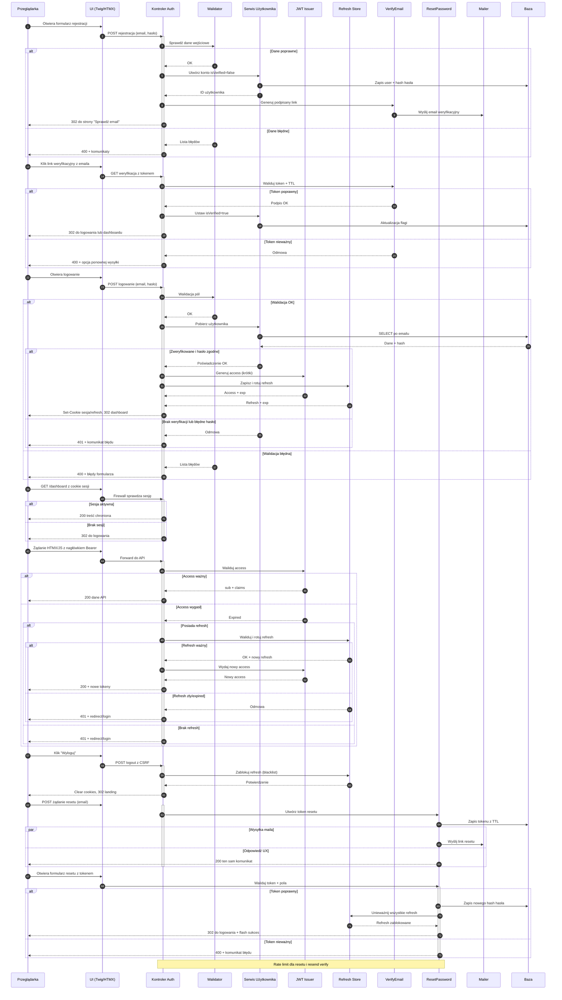

## Diagram sekwencji autentykacji (Symfony: sesja + JWT)

```mermaid
sequenceDiagram
  autonumber
  participant B as Przeglądarka
  participant UI as UI (Twig/HTMX)
  participant Auth as Kontroler Auth
  participant Ver as Walidator
  participant UserSvc as Serwis Użytkownika
  participant JWT as JWT Issuer
  participant Ref as Refresh Store
  participant Verify as VerifyEmail
  participant Reset as ResetPassword
  participant Mail as Mailer
  participant DB as Baza

  %% Rejestracja i weryfikacja email
  B->>UI: Otwiera formularz rejestracji
  UI->>Auth: POST rejestracja (email, hasło)
  activate Auth
  Auth->>Ver: Sprawdź dane wejściowe
  alt Dane poprawne
    Ver-->>Auth: OK
    Auth->>UserSvc: Utwórz konto isVerified=false
    UserSvc->>DB: Zapis user + hash hasła
    UserSvc-->>Auth: ID użytkownika
    Auth->>Verify: Generuj podpisany link
    Verify->>Mail: Wyślij email weryfikacyjny
    Auth-->>B: 302 do strony "Sprawdź email"
  else Dane błędne
    Ver-->>Auth: Lista błędów
    Auth-->>B: 400 + komunikaty
  end
  deactivate Auth

  B->>UI: Klik link weryfikacyjny z emaila
  UI->>Auth: GET weryfikacja z tokenem
  activate Auth
  Auth->>Verify: Waliduj token + TTL
  alt Token poprawny
    Verify-->>Auth: Podpis OK
    Auth->>UserSvc: Ustaw isVerified=true
    UserSvc->>DB: Aktualizacja flagi
    Auth-->>B: 302 do logowania lub dashboardu
  else Token nieważny
    Verify-->>Auth: Odmowa
    Auth-->>B: 400 + opcja ponownej wysyłki
  end
  deactivate Auth

  %% Logowanie
  B->>UI: Otwiera logowanie
  UI->>Auth: POST logowanie (email, hasło)
  activate Auth
  Auth->>Ver: Walidacja pól
  alt Walidacja OK
    Ver-->>Auth: OK
    Auth->>UserSvc: Pobierz użytkownika
    UserSvc->>DB: SELECT po emailu
    DB-->>UserSvc: Dane + hash
    alt Zweryfikowane i hasło zgodne
      UserSvc-->>Auth: Poświadczenie OK
      Auth->>JWT: Generuj access (krótki)
      Auth->>Ref: Zapisz i rotuj refresh
      JWT-->>Auth: Access + exp
      Ref-->>Auth: Refresh + exp
      Auth-->>B: Set-Cookie sesja/refresh, 302 dashboard
    else Brak weryfikacji lub błędne hasło
      UserSvc-->>Auth: Odmowa
      Auth-->>B: 401 + komunikat błędu
    end
  else Walidacja błędna
    Ver-->>Auth: Lista błędów
    Auth-->>B: 400 + błędy formularza
  end
  deactivate Auth

  %% Dostęp do zasobu HTML (sesja)
  B->>UI: GET /dashboard z cookie sesji
  UI->>Auth: Firewall sprawdza sesję
  activate Auth
  alt Sesja aktywna
    Auth-->>B: 200 treść chroniona
  else Brak sesji
    Auth-->>B: 302 do logowania
  end
  deactivate Auth

  %% Dostęp API z JWT
  B->>UI: Żądanie HTMX/JS z nagłówkiem Bearer
  UI->>Auth: Forward do API
  activate Auth
  Auth->>JWT: Waliduj access
  alt Access ważny
    JWT-->>Auth: sub + claims
    Auth-->>B: 200 dane API
  else Access wygasł
    JWT-->>Auth: Expired
    alt Posiada refresh
      Auth->>Ref: Waliduj i rotuj refresh
      alt Refresh ważny
        Ref-->>Auth: OK + nowy refresh
        Auth->>JWT: Wydaj nowy access
        JWT-->>Auth: Nowy access
        Auth-->>B: 200 + nowe tokeny
      else Refresh zły/expired
        Ref-->>Auth: Odmowa
        Auth-->>B: 401 + redirect/login
      end
    else Brak refresh
      Auth-->>B: 401 + redirect/login
    end
  end
  deactivate Auth

  %% Wylogowanie
  B->>UI: Klik "Wyloguj"
  UI->>Auth: POST logout z CSRF
  activate Auth
  Auth->>Ref: Zablokuj refresh (blacklist)
  Ref-->>Auth: Potwierdzenie
  Auth-->>B: Clear cookies, 302 landing
  deactivate Auth

  %% Reset hasła
  B->>UI: POST żądanie resetu (email)
  activate Auth
  Auth->>Reset: Utwórz token resetu
  Reset->>DB: Zapis tokenu z TTL
  par Wysyłka maila
    Reset->>Mail: Wyślij link resetu
  and Odpowiedź UX
    Reset-->>B: 200 ten sam komunikat
  end
  deactivate Auth

  B->>UI: Otwiera formularz resetu z tokenem
  UI->>Reset: Waliduj token + pola
  activate Reset
  alt Token poprawny
    Reset->>DB: Zapis nowego hash hasła
    Reset->>Ref: Unieważnij wszystkie refresh
    Ref-->>Reset: Refresh zablokowane
    Reset-->>B: 302 do logowania + flash sukces
  else Token nieważny
    Reset-->>B: 400 + komunikat błędu
  end
  deactivate Reset

  Note over Auth,Reset: Rate limit dla resetu i resend verify
```

